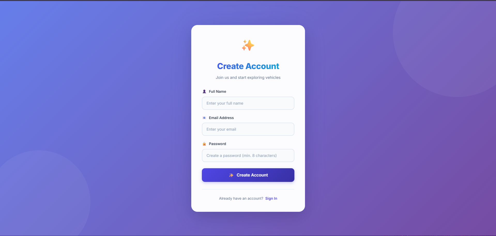
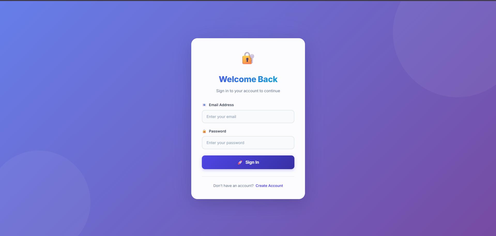
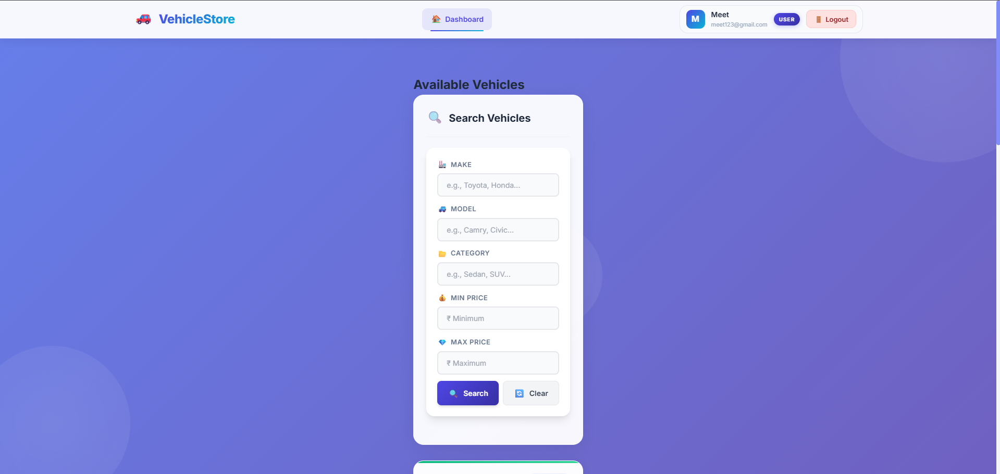
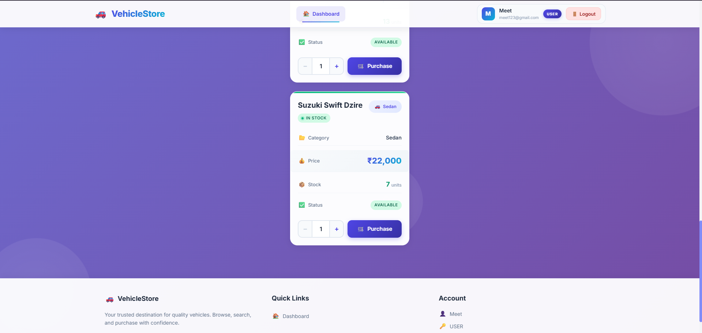
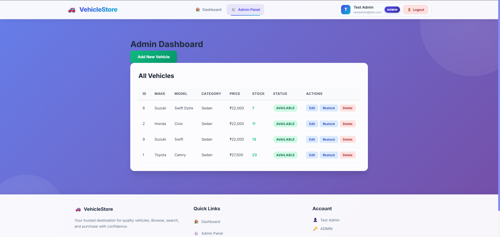
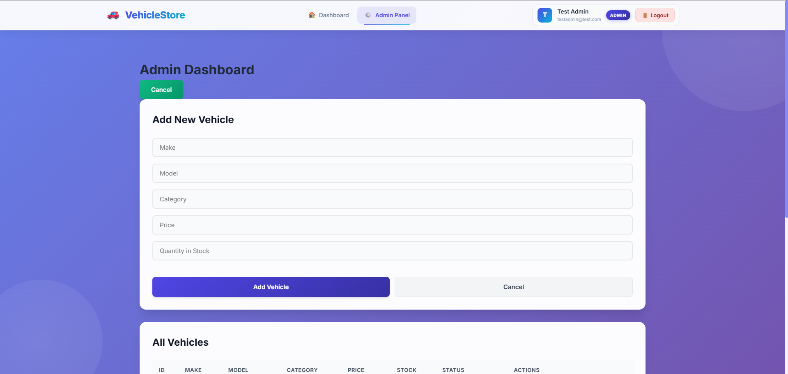

# Car Dealership Management System

A full-stack car dealership inventory management system built with **Spring Boot**, **React**, and **PostgreSQL**. It lets dealership staff manage a vehicle inventory (add, update, search, restock, sell) while separating access between regular **users** and **admins**, secured with JWT-based authentication.

## Table of Contents

- [Features](#features)
- [Screenshots](#screenshots)
- [Tech Stack](#tech-stack)
- [Project Structure](#project-structure)
- [Prerequisites](#prerequisites)
- [Getting Started](#getting-started)
  - [1. Clone the repository](#1-clone-the-repository)
  - [2. Set up PostgreSQL](#2-set-up-postgresql)
  - [3. Backend setup (Spring Boot)](#3-backend-setup-spring-boot)
  - [4. Frontend setup (React)](#4-frontend-setup-react)
- [Environment Variables](#environment-variables)
- [API Overview](#api-overview)
- [Running with Docker (backend)](#running-with-docker-backend)
- [Building for Production](#building-for-production)
- [Live Demo](#live-demo)
- [Test Report](#test-report)
- [My AI Usage](#my-ai-usage)

## Features

- **User authentication** — registration and login with JWT-based, stateless session handling.
- **Role-based access control** — `USER` and `ADMIN` roles, with admin-only actions like adding, editing, deleting, and restocking vehicles.
- **Vehicle inventory management** — create, update, delete, and list vehicles with details like make, model, category, price, and stock quantity.
- **Search & filtering** — search vehicles by make, model, category, and price range.
- **Purchases & restocking** — decrement stock on purchase, admins can restock inventory.
- **Secure password storage** — passwords hashed with BCrypt.
- **CORS-configured API** — configurable allowed origins for connecting the frontend to the backend.

## Screenshots

### Register


### Login


### Dashboard


### Vehicle Cards


### Admin Panel


### Add Vehicle


## Tech Stack

**Backend**
- Java 21
- Spring Boot 3.2 (Web, Data JPA, Security, Validation)
- PostgreSQL
- JJWT (JSON Web Tokens) for authentication
- Lombok
- Maven

**Frontend**
- React 19
- Vite
- React Router
- Axios
- Tailwind CSS
- react-hot-toast, SweetAlert2, react-icons, react-spinners

## Project Structure

```
car-dealership-management/
├── backend/
│   └── inventory/                # Spring Boot application
│       ├── src/main/java/com/example/inventory/
│       │   ├── config/            # CORS & Security configuration
│       │   ├── controller/        # REST controllers (Auth, Vehicle)
│       │   ├── dto/               # Request/response DTOs
│       │   ├── entity/            # JPA entities (User, Vehicle, Role)
│       │   ├── exception/         # Custom exceptions & global handler
│       │   ├── repository/        # Spring Data JPA repositories
│       │   ├── security/          # JWT filter/service, user details
│       │   └── service/           # Business logic
│       ├── src/main/resources/    # application.properties
│       ├── Dockerfile
│       └── pom.xml
└── frontend/
    └── car-management/            # React (Vite) application
        ├── src/
        │   ├── api/                # Axios instance & API calls
        │   ├── components/         # Reusable UI components
        │   ├── context/            # Auth context
        │   ├── layouts/            # Page layout wrappers
        │   ├── pages/              # Login, Register, Dashboard, Admin
        │   └── styles/             # CSS files
        └── package.json
```

## Prerequisites

Make sure you have the following installed before setting up the project:

- **Java 21** (JDK)
- **Maven** (or use the included `mvnw` wrapper — no separate install needed)
- **Node.js** (v18+) and **npm**
- **PostgreSQL** (v13+ recommended)
- **Git**

## Getting Started

### 1. Clone the repository

```bash
git clone https://github.com/HARSHIL689/car-dealership-management.git
cd car-dealership-management
```

### 2. Set up PostgreSQL

Create a local database for the project:

```sql
CREATE DATABASE car_inventory;
```

By default, the backend connects to `jdbc:postgresql://localhost:5432/car_inventory` with username `postgres`. You can override these with environment variables (see [Environment Variables](#environment-variables)).

The application uses `spring.jpa.hibernate.ddl-auto=update`, so tables are created/updated automatically on startup — no manual schema setup is required.

### 3. Backend setup (Spring Boot)

Navigate to the backend directory:

```bash
cd backend/inventory
```

Set the required environment variables (see the [Environment Variables](#environment-variables) section below for details), for example:

```bash
export DATABASE_URL=jdbc:postgresql://localhost:5432/car_inventory
export DATABASE_USERNAME=postgres
export DATABASE_PASSWORD=your_postgres_password
export JWT_SECRET=your_long_random_secret_key
export FRONTEND_URL=http://localhost:5173
```

Run the application using the Maven wrapper:

```bash
# On macOS/Linux
./mvnw spring-boot:run

# On Windows
mvnw.cmd spring-boot:run
```

The backend will start on **http://localhost:8080** by default (configurable via the `PORT` environment variable).

### 4. Frontend setup (React)

In a new terminal, navigate to the frontend directory:

```bash
cd frontend/car-management
```

Install dependencies:

```bash
npm install
```

Create a `.env` file in `frontend/car-management/` to point the frontend at your local backend (optional — it defaults to `http://localhost:8080` if unset):

```
VITE_API_URL=http://localhost:8080
```

Start the development server:

```bash
npm run dev
```

The frontend will start on **http://localhost:5173** (Vite's default port) and will connect to the backend API.

> **Note:** Make sure the backend's `FRONTEND_URL` environment variable matches the URL where your frontend is running, so CORS allows the requests.

## Environment Variables

### Backend (`backend/inventory`)

| Variable | Description | Default |
|---|---|---|
| `DATABASE_URL` | JDBC connection string for PostgreSQL | `jdbc:postgresql://localhost:5432/car_inventory` |
| `DATABASE_USERNAME` | Database username | `postgres` |
| `DATABASE_PASSWORD` | Database password | *(required, no default)* |
| `JWT_SECRET` | Secret key used to sign JWTs | *(required, no default)* |
| `PORT` | Port the backend listens on | `8080` |
| `FRONTEND_URL` | Allowed CORS origin(s) for the frontend | `http://localhost:5173` |
| `SPRING_PROFILES_ACTIVE` | Active Spring profile (`dev` or `prod`) | `dev` |

### Frontend (`frontend/car-management`)

| Variable | Description | Default |
|---|---|---|
| `VITE_API_URL` | Base URL of the backend API | `http://localhost:8080` |

## API Overview

All endpoints are prefixed with `/api`. JWT tokens (obtained from `/api/auth/login`) must be sent as a `Bearer` token in the `Authorization` header for protected routes.

### Auth (`/api/auth`) — public

| Method | Endpoint | Description |
|---|---|---|
| POST | `/api/auth/register` | Register a new user |
| POST | `/api/auth/login` | Log in and receive a JWT |

### Vehicles (`/api/vehicles`) — requires authentication

| Method | Endpoint | Description | Access |
|---|---|---|---|
| GET | `/api/vehicles` | List all available vehicles (`?includeOutOfStock=true` to include sold-out) | Any authenticated user |
| GET | `/api/vehicles/search` | Search by `make`, `model`, `category`, `minPrice`, `maxPrice` | Any authenticated user |
| POST | `/api/vehicles` | Add a new vehicle | Admin only |
| PUT | `/api/vehicles/{id}` | Update a vehicle's details | Admin only |
| DELETE | `/api/vehicles/{id}` | Delete a vehicle | Admin only |
| POST | `/api/vehicles/{id}/purchase` | Purchase a vehicle (decreases stock) | Any authenticated user |
| POST | `/api/vehicles/{id}/restock` | Restock a vehicle (increases stock) | Admin only |

## Running with Docker (backend)

A `Dockerfile` is included for the backend. To build and run it:

```bash
cd backend/inventory
docker build -t car-inventory-backend .
docker run -p 8080:8080 \
  -e DATABASE_URL=jdbc:postgresql://<db-host>:5432/car_inventory \
  -e DATABASE_USERNAME=postgres \
  -e DATABASE_PASSWORD=your_password \
  -e JWT_SECRET=your_secret \
  -e FRONTEND_URL=http://localhost:5173 \
  car-inventory-backend
```

## Building for Production

**Backend:**

```bash
cd backend/inventory
./mvnw clean package -DskipTests
java -jar target/*.jar
```

**Frontend:**

```bash
cd frontend/car-management
npm run build
```

This generates a production-ready build in `frontend/car-management/dist/`, which can be deployed to any static hosting provider (Vercel, Netlify, etc.). Remember to set `VITE_API_URL` to your deployed backend URL before building.

## Live Demo

The deployed project can be viewed here: [car-dealership-management-tldz.onrender.com](https://car-dealership-management-tldz.onrender.com/)

## Test Report

The backend test suite was run with Maven (`./mvnw test`) using JUnit 5 and Mockito, against an in-memory H2 database configured specifically for the test environment (so the suite doesn't depend on a live PostgreSQL instance or real secrets).

### Summary

| Metric | Result |
|---|---|
| **Test classes run** | 3 |
| **Total tests run** | 16 |
| **Passed** | 16 |
| **Failures** | 0 |
| **Errors** | 0 |
| **Skipped** | 0 |
| **Build status** | ✅ `BUILD SUCCESS` |
| **Total execution time** | ~10.5s |

### Results by test class

| Test class | Tests | Failures | Errors | Time |
|---|---|---|---|---|
| `InventoryApplicationTests` | 1 | 0 | 0 | 6.058s |
| `AuthServiceTest` | 5 | 0 | 0 | 0.715s |
| `VehicleServiceTest` | 10 | 0 | 0 | 0.200s |

### What's covered

**`InventoryApplicationTests`**
- Verifies the full Spring application context loads successfully (`contextLoads`), including security, JPA, and web configuration.

**`AuthServiceTest`** (5 tests)
- Registering a new user with the default `USER` role
- Registering a new user with an explicit `ADMIN` role
- Rejecting registration when the email is already in use (`EmailAlreadyExistsException`)
- Logging in successfully and receiving a valid JWT
- Rejecting login with invalid credentials (`InvalidCredentialsException`)

**`VehicleServiceTest`** (10 tests)
- Adding a new vehicle successfully
- Rejecting a duplicate vehicle (same make, model, category, and price)
- Listing vehicles while excluding out-of-stock items by default
- Listing vehicles including out-of-stock items when requested
- Purchasing a vehicle and correctly reducing stock
- Rejecting a purchase when requested quantity exceeds available stock (`InsufficientStockException`)
- Rejecting a purchase for a non-existent vehicle (`VehicleNotFoundException`)
- Restocking a vehicle and correctly increasing stock
- Deleting an existing vehicle
- Rejecting deletion of a non-existent vehicle (`VehicleNotFoundException`)

### Raw output

```
[INFO] Running com.example.inventory.InventoryApplicationTests
[INFO] Tests run: 1, Failures: 0, Errors: 0, Skipped: 0, Time elapsed: 6.058 s -- in com.example.inventory.InventoryApplicationTests
[INFO] Running com.example.inventory.service.AuthServiceTest
[INFO] Tests run: 5, Failures: 0, Errors: 0, Skipped: 0, Time elapsed: 0.715 s -- in com.example.inventory.service.AuthServiceTest
[INFO] Running com.example.inventory.service.VehicleServiceTest
[INFO] Tests run: 10, Failures: 0, Errors: 0, Skipped: 0, Time elapsed: 0.200 s -- in com.example.inventory.service.VehicleServiceTest

[INFO] Results:
[INFO]
[INFO] Tests run: 16, Failures: 0, Errors: 0, Skipped: 0
[INFO]
[INFO] ------------------------------------------------------------------------
[INFO] BUILD SUCCESS
[INFO] ------------------------------------------------------------------------
[INFO] Total time:  10.461 s
```

### How to reproduce

```bash
cd backend/inventory
./mvnw test
```

Detailed per-test XML/TXT reports are generated in `backend/inventory/target/surefire-reports/` after each run.

## My AI Usage

I used AI tools throughout the development of this project — primarily **Claude**, along with **OpenAI** and **DeepSeek** — as coding assistants rather than as a replacement for understanding the system.

**Backend**
- Generated boilerplate for the JWT authentication flow (token generation/validation, the security filter chain, and `UserDetailsService` wiring), which I then reviewed and adapted to fit the project's structure.
- Helped design and write the unit test suite (`AuthServiceTest`, `VehicleServiceTest`) using JUnit 5 and Mockito, covering both the happy paths and the edge cases (duplicate vehicles, insufficient stock, invalid credentials, not-found scenarios).
- Diagnosed a failing `contextLoads` test caused by the Spring context trying to connect to a real PostgreSQL database during test runs, and helped set up an isolated in-memory H2 configuration for tests so the full suite can run without external dependencies or secrets.
- Assisted with debugging exceptions, interpreting stack traces, and fixing Maven/Spring configuration issues.

**Frontend**
- Most of the UI was designed and styled with AI assistance — including component structure, Tailwind CSS styling, layout decisions, and responsive design.
- Helped generate larger chunks of repetitive UI code (forms, cards, protected routes) faster than writing them by hand.

**Overall**
AI was most valuable for speeding up repetitive/boilerplate work, catching errors early, generating realistic test cases, and — most importantly — surfacing edge cases I hadn't originally considered (like duplicate-vehicle detection or handling out-of-stock purchases).